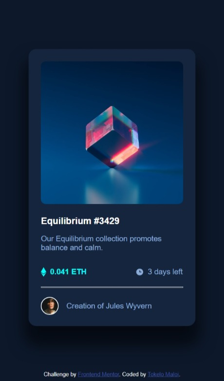
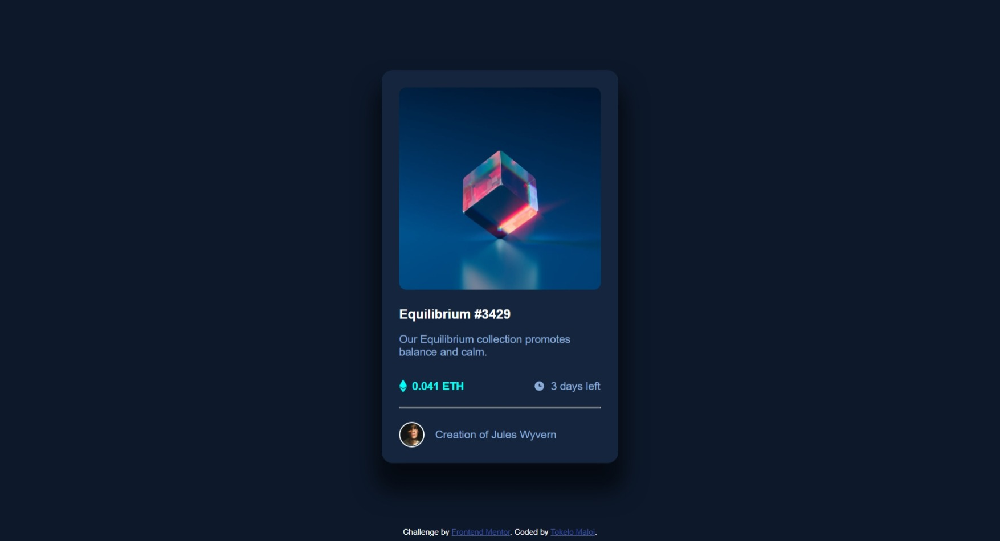

# Frontend Mentor - NFT preview card component solution

This is a solution to the [NFT preview card component challenge on Frontend Mentor](https://www.frontendmentor.io/challenges/nft-preview-card-component-SbdUL_w0U). Frontend Mentor challenges help you improve your coding skills by building realistic projects. 

## Table of contents

  - [The challenge](#the-challenge)
  - [Screenshots](#screenshots)
  - [Links](#links)
- [My process](#my-process)
  - [Built with](#built-with)
  - [What I learned](#what-i-learned)
  - [Continued development](#continued-development)
- [Author](#author)


### The challenge

Users should be able to:

- View the optimal layout depending on their device's screen size
- See hover states for interactive elements

### Screenshots




### Links

- Solution URL:(https://www.frontendmentor.io/solutions/nft-preview-card-component-using-flexbox-x0_2mvprSE)
- Live Site URL:(https://tk-ls97.github.io/NFT-preview-card/)

## My process

A cardio session as a retainer for my flexbox skills as I got to use them more. I also got to use animation to enable the active states which was usful as well. But overall a simple project or challenge in the end.

### Built with

- Semantic HTML5 markup
- CSS custom properties
- Flexbox
- Mobile-first workflow

### What I learned

I had to do some animations that I was not used to but I am very pleased with how they came out. 


```css

.imgContainer {
  position: relative;
}

.nft-pic {
  opacity: 1;
  display: block;
  width: 100%;
  height: auto;
  transform: 0.5s ease;
  -webkit-backface-visibility: hidden;
          backface-visibility: hidden;
}

.viewdiv {
  transition: 0.5s ease;
  opacity: 0;
  position: absolute;
  top: 50%;
  left: 50%;
  transform: translate(-50%, -50%);
  background-color: hsl(178deg, 100%, 50%);
  width: 278px;
  height: 278px;
  display: flex;
  align-items: center;
  justify-content: center;
}

.imgContainer:hover .nft-pic {
  opacity: 1;
}

.imgContainer:hover .viewdiv {
  opacity: 0.7;
  cursor: pointer;
  border-radius: 10px;
}

```

### Continued development

Flexbox is something I am well-versed with now thanks to these frontendmentor.io challenges and will use it in upcoming projects whether it be on their site or with my own projects.

## Author

- Frontend Mentor - [@TK-LS97](https://www.frontendmentor.io/profile/TK-LS97)
